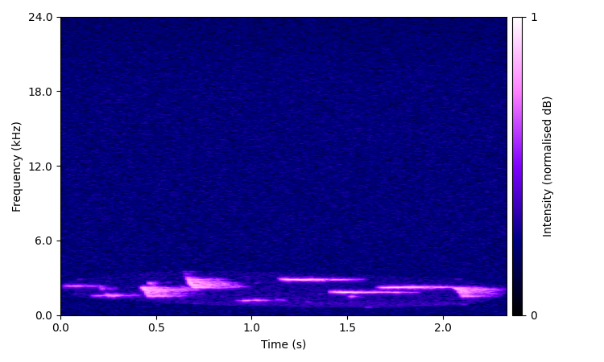
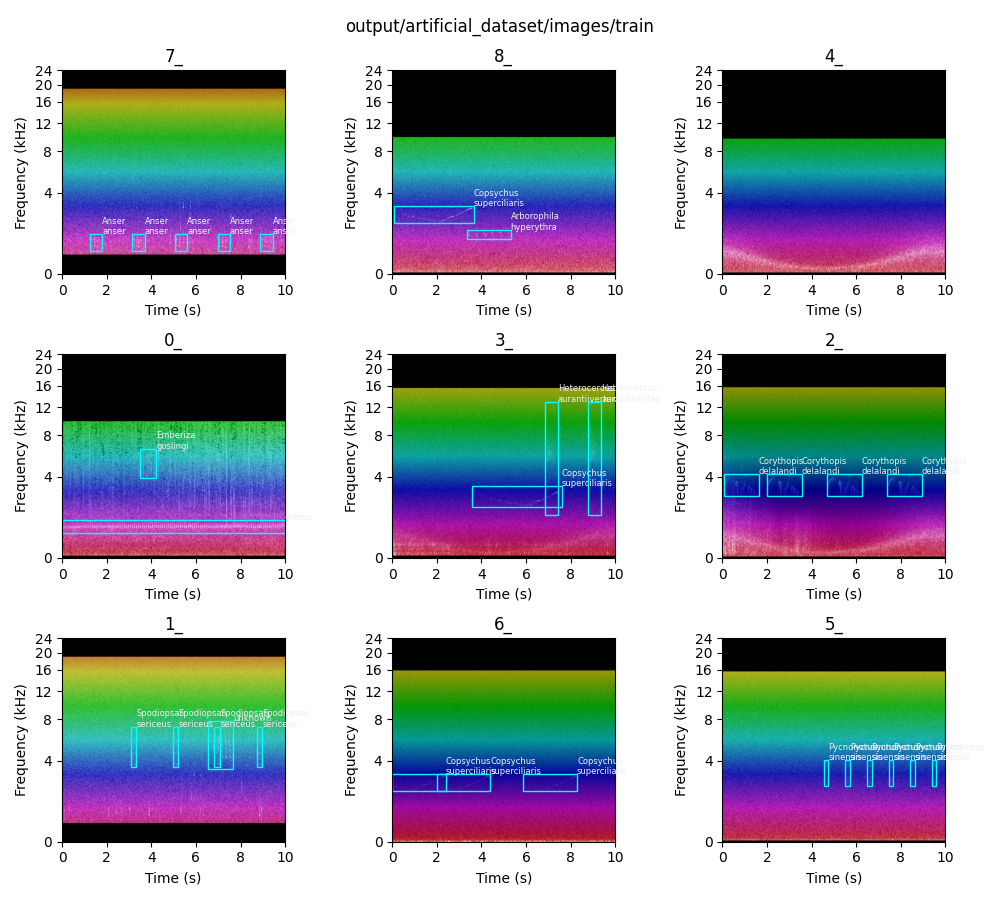
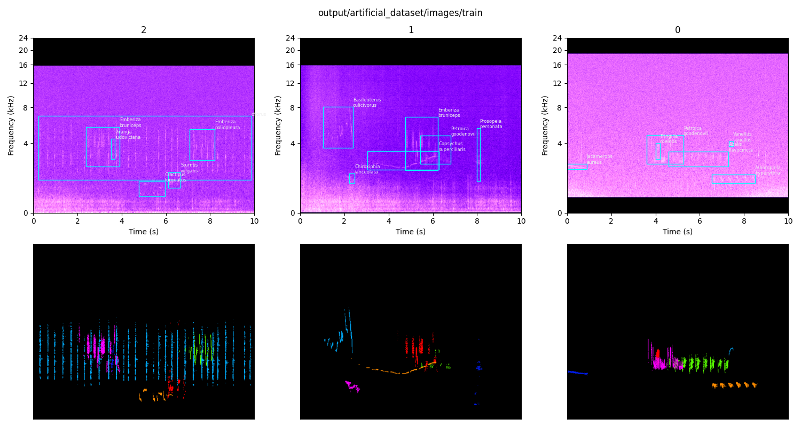

# overview

This is a condensed folder containing the core processes required to reproduce the results for the paper 'Robust Bioacoustic Detection via Richly Labelled Synthetic Soundscape Augmentation'. ```main.py``` is the primary file which handles dataset augmentation, while ```classifier_small.py``` is the primary file which handles EfficientNet fine-tuning. ```evaluation.py``` is the main file which produces the results by running parameter sweeps (running both main.py and classifier_small.py as subprocesses).

```eval_metrics.py``` can be used to compare and post-evaluate experiments.

Athene noctua (little owl, ruru nohinohi) datasets for augmentation (```rurunohinohi_augmentation_dataset```) and evaluation (```real_life_eval_little_owl```) may be used to reproduce the results with a suitable graphics card.

# bioacoustic data augmentation pipeline

- pip install -r requirements.txt
- edit ```config.yaml``` (view ```config_example.yaml``` to see settings for use with multi-class datasets)
- run ```main.py```

### - provide dataset folder path containing:
1. audio of individual mask-cropped vocalisations (details below)
2. mask-cropped 'negative' examples for adversarial (optional, details below)
3. background noise (files must be longer than output length, default 10s)

each category may have a tags.csv file containing:
- a 'filename' column.
- vocalisations csv needs 'species' column to get richly labelled output.
- (optional) noise can have a csv with 'highpass' and 'lowpass' columns. these constrain the bandpass filter applied to soundscapes generated using that noise clip.
- negative category doesn't need a tags file but it won't break anything.

without tags files the pipeline will still work in single class mode.

example folder structure:

    example_dataset/
        vocalisations/
            1.wav
            tags.csv
        negative/
            3.wav
        noise/
            2.wav
            tags.csv

vocalisations and negative should be cropped from background e.g.


### output

- primary outputs spectrograms and labels in {output}/artificial_dataset
- labels are format: class, x_center, y_center, width, height
- optionally split into train + test folders
- optionally output audio
- optionally output vocalisation masks (as COCO json file)
- randomly repeats some vocalisations (see top left, below)
- labels are stored as integers, so a .csv map is generated to associate these with species names

output example:


the function can generate richly labelled training data:



# EfficientNetB0 Finetuning

- add project_root in ```classifiers/use_case.yaml```
- ensure FilePaths is correct in ```classifier_small.py```
- should work with other GPUs but only tested with 'mps'
- adjust TrainingParameters and DefaultAudio